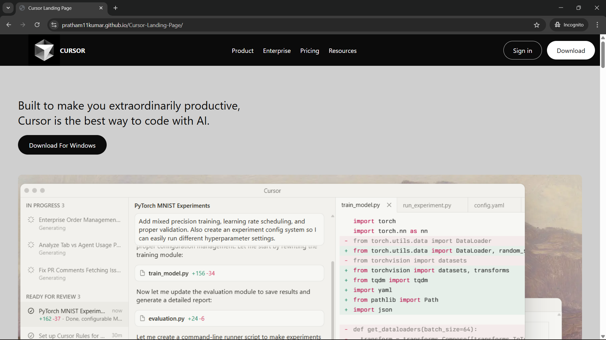
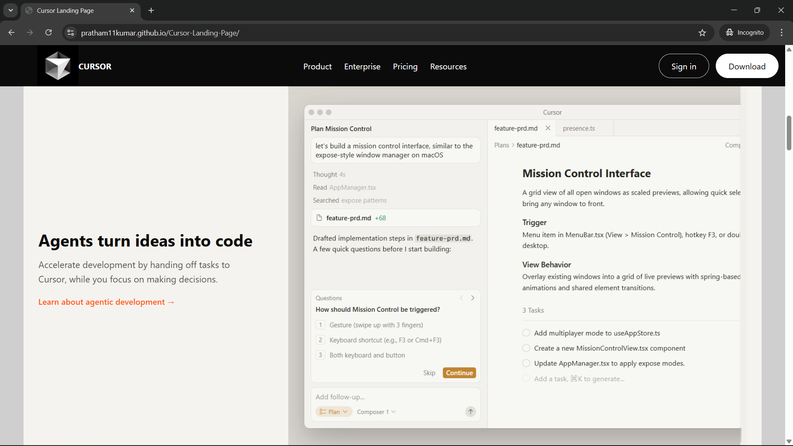
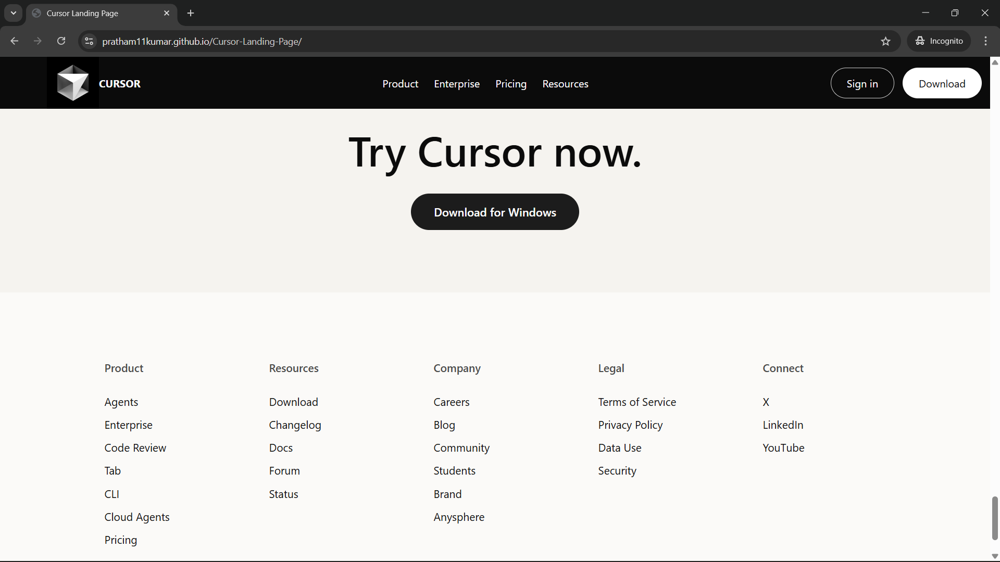

# Cursor Landing Page Clone

A desktop-first landing page inspired by the Cursor website, recreated using pure HTML and CSS.

---

## 🚀 Live Demo

👉 https://pratham11kumar.github.io/Cursor-Landing-Page/

---

## ✨ Sections Built

- Navigation bar
- Hero section
- Trusted logos section
- Feature showcase
- CTA buttons

---

## 📸 Screenshot

## 🛠 Technologies Used

- HTML5
- CSS3

---

## 📂 Project Structure

Cursor-Landing-Page
│
├── index.html
├── cursor.css
├── README.md
└── Images/

---

## ▶ How to Run Locally

1. Download the repo
2. Open `index.html` in a browser

---

## 🎯 Goal

To practice layout recreation, responsive structure, and clean frontend design using pure HTML & CSS.

---

## 👨‍💻 Author

Pratham Kumar
